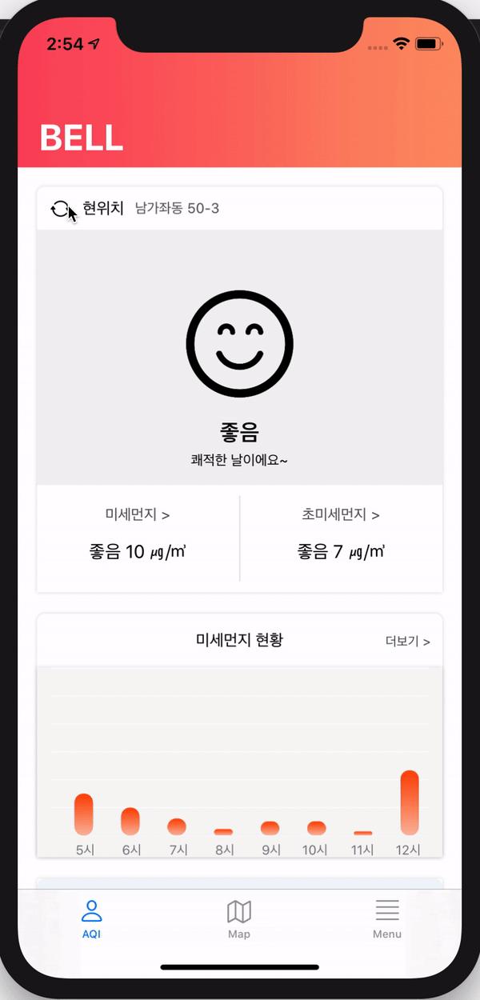
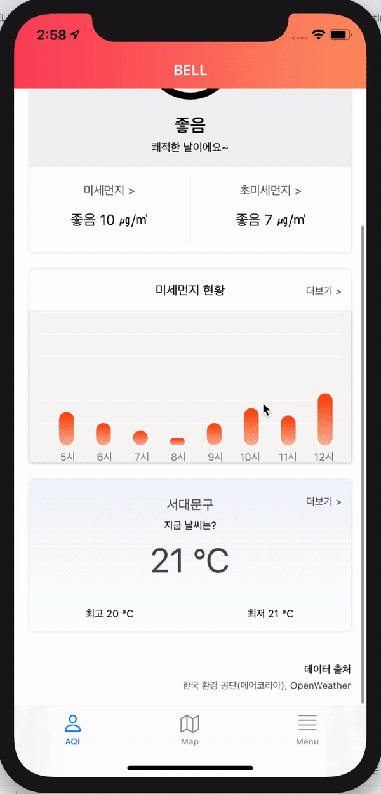
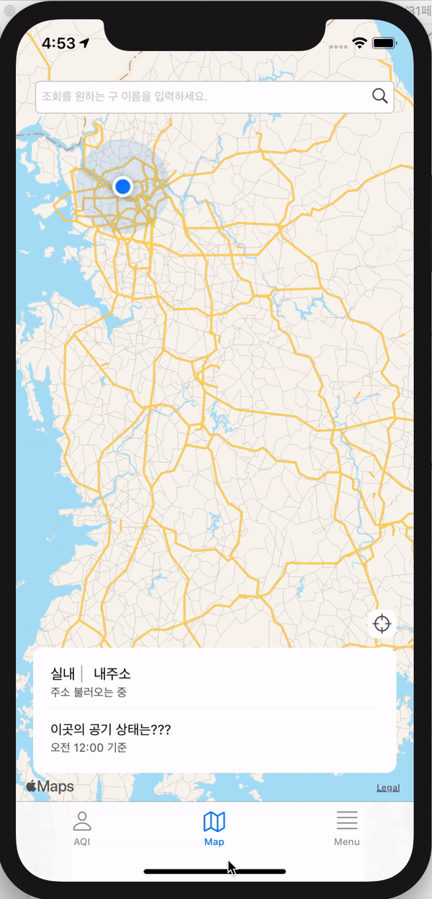
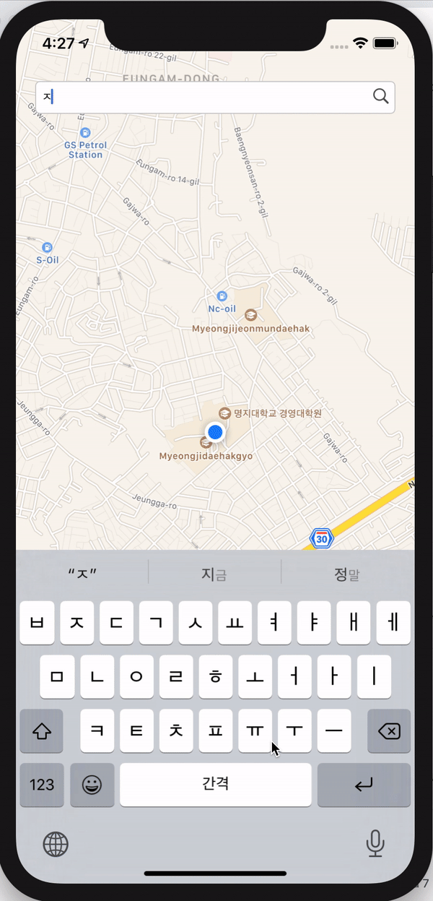
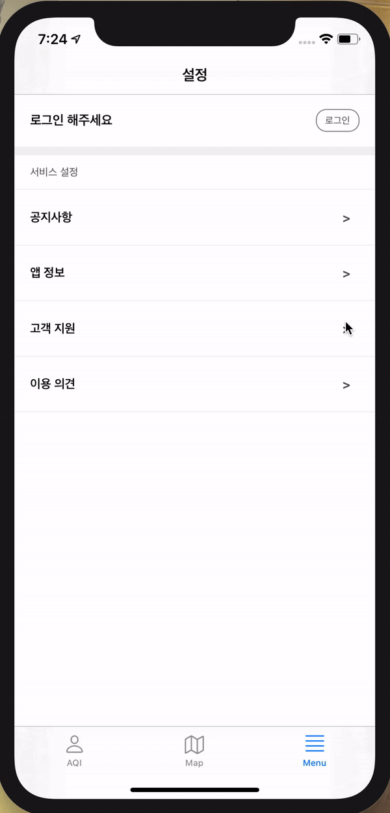

<p align="center">
   <br/>
</p>

<h1 align="center"> BELL _ iOS </h1>

<p align="center">
  
  
  
  
  
  
  
   
</p>

<p align="center">
  Myongji Univ. Capstone Project 2020-1 <br/> 
  Fine dust notification service
</p>

<br/>

## 📕 Development Environment

- Xcode : 11.3.1
- Swift : 5.0.1
- cocoapods : 1.9.1
- Libraries
  - [Macaw](https://github.com/exyte/Macaw)

<br/>

## 📕 How to start

```
$ git clone https://github.com/ChoiEunji0114/BELL_iOS.git
$ cd BELL
$ pod install
```

<br/>

## 📱 Screenshots 

### main tab

  

### map tab

  

### menu tab



<br/>

## API

1. [Fine dust API](https://www.data.go.kr/dataset/15000581/openapi.do)
2. [Weather API](https://openweathermap.org/)

<br/>

## 🐛 Issue

If you found a bug in this repository, please let me know through the [Issue](https://github.com/ChoiEunji0114/BELL_iOS/issues).

<br/>

> [This](https://github.com/mju-capstone/BELL_data_analysis) is a page for data analysis 

> [This](https://github.com/mju-capstone/BELL_web) is BELL webpage

